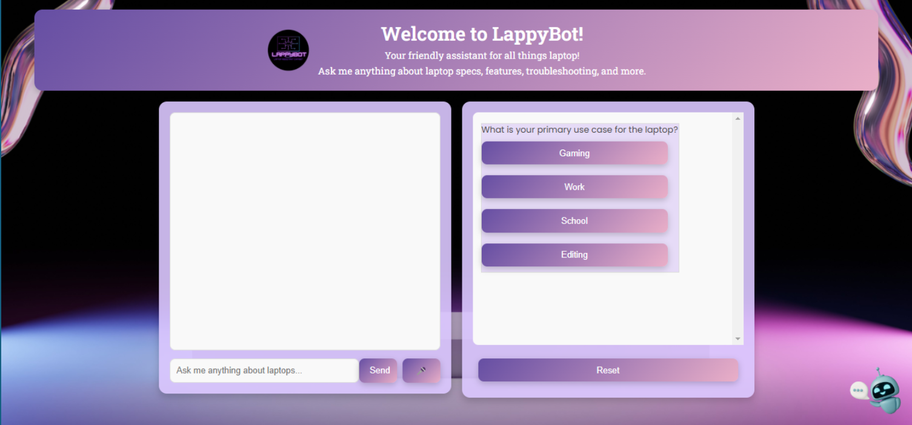

# LappyBot — Voice-Enabled Laptop Assistant (OpenAI GPT)

LappyBot is a **web-based assistant** that helps users quickly understand **laptop specs, features, and troubleshooting tips** using **OpenAI GPT**. It supports both **typed questions** and **voice input**.

---

## UI Preview

---

## What LappyBot Can Do
- **Ask anything about laptops**: specs, performance expectations, upgradeability, ports, battery life, and common issues
- **Voice-based questions** (hands-free): speak your question and send it instantly
- **Guided prompts**: quick buttons for common use-cases (e.g., Gaming, Work, School, Editing)
- **Clear, conversational answers** powered by **OpenAI GPT**

---

## Tech Stack
- **Backend:** Python (web app)
- **Frontend:** HTML/CSS/JavaScript
- **AI:** OpenAI GPT API
- **Voice Input:** Browser speech recognition (availability depends on browser/device)
